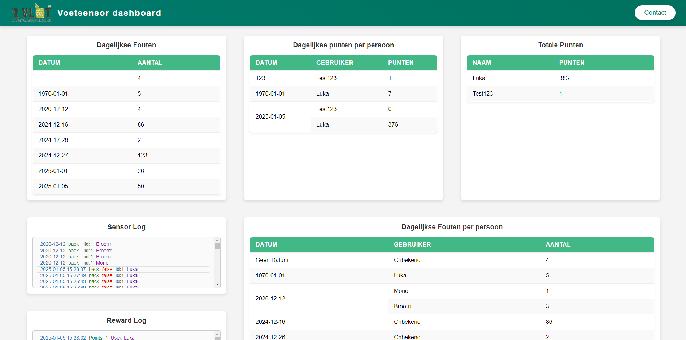

# Foot Sensor



## Overzicht
Het Foot Sensor-project combineert hardware en software om de druk op je voeten te monitoren, met feedback en analyses. Het omvat:
- Een dashboard om gegevens van de druksensoren weer te geven.
- Geluidswaarschuwingen wanneer de gebruiker te lang op de tenen blijft staan.

Zelfs zonder Wi-Fi-instellingen blijven de druksensoren lokaal functioneren.

---

## Technologie Stack
- **Frontend**: Angular
- **Backend**: Python Flask API
- **Database**: MongoDB
- **Containerisatie**: Docker Compose

---

## Vereisten

1. Zorg ervoor dat [Docker Desktop](https://www.docker.com/products/docker-desktop) is geïnstalleerd en actief.
2. Installeer de benodigde hardware, inclusief druksensoren en een bijbehorende microcontroller (bijv. Arduino).
3. Configureer de Wi-Fi-instellingen in het bestand `pressure_sensor.ino` voor netwerkfunctionaliteit (optioneel).

---

## Installatie-instructies

1. Clone de repository:
   ```bash
   git clone <repository-url>
   cd foot-sensor
   ```

2. Bouw en start het project met Docker Compose:
   ```bash
   docker compose up --build
   ```

3. Pas de Wi-Fi-instellingen aan:
   - Navigeer naar `pressure_sensor/pressure_sensor.ino`.
   - Werk de volgende regels bij met je Wi-Fi-instellingen:
     ```cpp
     const char* ssid = "<Je-WiFi-SSID>";       // Vervang met je Wi-Fi SSID
     const char* password = "<Je-WiFi-Wachtwoord>"; // Vervang met je Wi-Fi-wachtwoord
     ```
   - Sla op en upload de bijgewerkte code naar de microcontroller.

4. Open het dashboard:
   - Open een browser en ga naar de opgegeven URL (bijv. `http://localhost:4200`).

---

## Functionaliteiten

1. **Drukmonitoring**:
   - Volgt de druk die door de gebruiker wordt uitgeoefend.
   - Stuurt geluidswaarschuwingen als de gebruiker te lang op de tenen blijft staan.

2. **Dashboard Visualisatie**:
   - Geeft realtime gegevens weer wanneer verbonden met Wi-Fi.
   - Er worden geen gegevens weergegeven op het dashboard als Wi-Fi niet is geconfigureerd, maar de sensoren blijven lokaal functioneren.

3. **Offline Functionaliteit**:
   - Werkt zonder Wi-Fi, met geluidswaarschuwingen indien nodig.

---

## Problemen oplossen

1. **Docker Problemen**:
   - Zorg ervoor dat Docker Desktop actief is voordat je het `docker compose`-commando uitvoert.
   - Gebruik `docker ps` om te controleren of de containers correct draaien.

2. **Wi-Fi Configuratie**:
   - Controleer de SSID en het wachtwoord in het bestand `pressure_sensor.ino`.
   - Zorg ervoor dat de microcontroller de juiste firmware heeft.

3. **Toegang tot Dashboard**:
   - Controleer of de frontend-container draait.
   - Als je geen toegang hebt tot `http://localhost:4200`, controleer de Docker-logs op fouten:
     ```bash
     docker logs <container-id>
     ```

---

## Toekomstige Verbeteringen
- Voeg gebruikersauthenticatie toe voor veilige toegang tot het dashboard.
- Verhoog de analyses met extra visualisatiemogelijkheden.
- Voeg een mobiele versie van het dashboard toe.